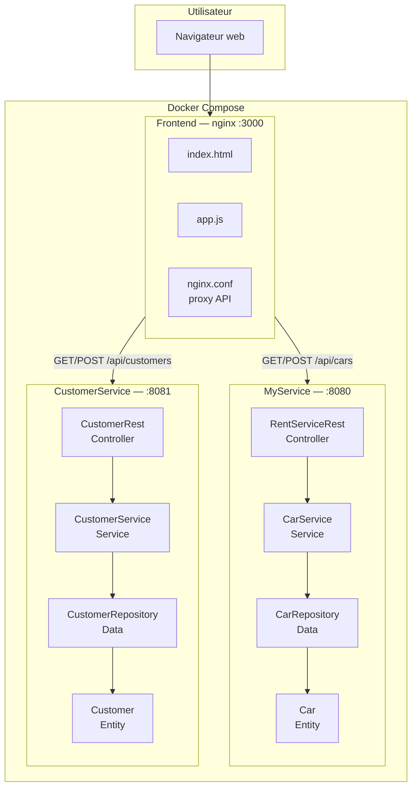
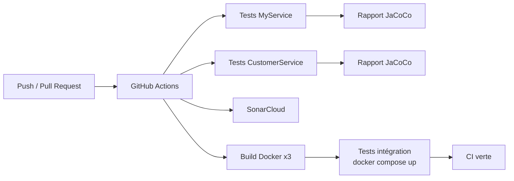

# Rapport de projet DevOps — Rent

**Application de location de voitures**

---

## Page de garde

| | |
|---|---|
| [DevOps] |
| [EFREI] |
| [2025-2026] |
| Patrick WU · Louisa MAIBECHE |
| LSI2 |
| https://github.com/GeratorWu/rent-main |

---

## Table des matières

1. [Introduction](#1-introduction)
2. [Architecture logicielle](#2-architecture-logicielle)
3. [Pipeline CI/CD](#3-pipeline-cicd)
4. [Tests](#4-tests)
5. [Couverture de code (JaCoCo)](#5-couverture-de-code-jacoco)
6. [Qualité logicielle (SonarCloud)](#6-qualité-logicielle-sonarcloud)
7. [Docker et déploiement](#7-docker-et-déploiement)
8. [Front Web (bonus)](#8-front-web-bonus)
9. [Google Cloud Labs](#9-google-cloud-labs)
10. [Conclusion](#10-conclusion)

---

## 1. Introduction

### 1.1 Contexte

Ce projet a été réalisé dans le cadre du cours de DevOps et répond au sujet : développer une application en respectant les pratiques d'intégration continue, d'architecture en couches et de qualité logicielle.

### 1.2 Objectif de l'application

**Rent** est une application de gestion de location de voitures permettant de :

- gérer un parc de voitures (ajout, consultation) ;
- gérer une base de clients (ajout, consultation) ;
- interagir via une interface web.

### 1.3 Choix techniques

| Composant | Technologie |
|-----------|-------------|
| Langage back-end | Java 21 |
| Framework | Spring Boot 3.2 |
| Build | Gradle |
| Tests | JUnit 5, MockMvc |
| Couverture | JaCoCo |
| Qualité | SonarCloud |
| Conteneurisation | Docker, Docker Compose |
| Front-end | HTML / CSS / JavaScript + nginx |
| CI | GitHub Actions |
| Hébergement du code | GitHub |

---

## 2. Architecture logicielle

### 2.1 Vue d'ensemble

L'application est composée de **deux microservices back-end** et d'un **frontend**, orchestrés par Docker Compose.



### 2.2 Architecture en couches (par service)

Chaque service back-end respecte la séparation en **3 couches** demandée par le sujet :

```mermaid
flowchart LR
    subgraph CoucheController["Couche Controller (Web)"]
        REST[API REST<br/>@RestController]
    end

    subgraph CoucheService["Couche Service"]
        SVC[Logique métier<br/>@Service]
    end

    subgraph CoucheData["Couche Data"]
        REPO[Repository<br/>@Repository]
        ENT[Entité<br/>Car / Customer]
    end

    REST --> SVC --> REPO --> ENT
```

| Couche | Responsabilité | MyService | CustomerService |
|--------|----------------|-----------|-----------------|
| **Controller** | Recevoir les requêtes HTTP, renvoyer les réponses JSON | `RentServiceRest` | `CustomerRest` |
| **Service** | Appliquer la logique métier | `CarService` | `CustomerService` |
| **Data** | Stocker et récupérer les données | `CarRepository` | `CustomerRepository` |
| **Entity** | Modèle de données | `Car` | `Customer` |

> **Note :** les données sont stockées en mémoire (pas de base de données). Le bonus « Base de données » n'a pas été implémenté.

### 2.3 Endpoints API

#### MyService — Voitures (port 8080)

| Méthode | Endpoint | Corps JSON | Réponse |
|---------|----------|------------|---------|
| `GET` | `/` | — | `"Hello"` |
| `POST` | `/cars` | `{"plateNumber","brand","price"}` | 200 OK |
| `GET` | `/cars` | — | Liste de voitures |
| `GET` | `/cars/{plateNumber}` | — | Une voiture |

#### CustomerService — Clients (port 8081)

| Méthode | Endpoint | Corps JSON | Réponse |
|---------|----------|------------|---------|
| `GET` | `/` | — | `"Hello from CustomerService"` |
| `POST` | `/customers` | `{"id","name","email"}` | 200 OK |
| `GET` | `/customers` | — | Liste de clients |
| `GET` | `/customers/{id}` | — | Un client |

### 2.4 Schéma de la pipeline CI



---

## 3. Pipeline CI/CD

### 3.1 Description

Le pipeline est défini dans `.github/workflows/action.yml` et se déclenche sur :

- push vers `main` ou `develop`
- pull request vers `main` ou `develop`

### 3.2 Étapes du pipeline

| # | Étape | Description |
|---|-------|-------------|
| 1 | Checkout | Récupération du code |
| 2 | Setup JDK 21 | Installation de Java 21 (Temurin) |
| 3 | Tests MyService | `./gradlew clean check jacocoTestReport` |
| 4 | Tests CustomerService | `./gradlew clean check jacocoTestReport` |
| 5 | Publication résultats tests | Rapport JUnit sur GitHub |
| 6 | Upload JaCoCo | Artefacts de couverture téléchargeables |
| 7 | SonarCloud | Analyse qualité (si secrets configurés) |
| 8 | Build Docker | `docker compose build` (3 images) |
| 9 | Tests intégration | `docker compose up` + tests curl |

### 3.3 Captures d'écran CI

> **À compléter :** insérer vos captures d'écran ci-dessous.

#### Pipeline CI — exécution réussie

```
[Insérer capture d'écran GitHub Actions — workflow complet en vert]
```

#### Détail des tests publiés

```
[Insérer capture d'écran des résultats de tests JUnit sur GitHub]
```

#### Artefacts JaCoCo

```
[Insérer capture d'écran des artefacts JaCoCo téléchargés depuis GitHub Actions]
```

#### Lien vers la dernière exécution

[URL directe vers la dernière exécution CI réussie]

---

## 4. Tests

### 4.1 Stratégie de test

Le projet teste **chaque couche** de chaque service :

| Type de test | Framework | Couche testée |
|--------------|-----------|---------------|
| Tests unitaires | JUnit 5 | Entity, Data (Repository), Service |
| Tests web (mocks) | MockMvc (Spring Test) | Controller (API REST) |
| Test de contexte | Spring Boot Test | Démarrage de l'application |
| Tests d'intégration | Script PowerShell + curl (CI) | Services Docker |

### 4.2 Inventaire des tests

#### MyService — 18 tests

| Fichier de test | Couche | Nombre de tests |
|-----------------|--------|:---------------:|
| `CarTest.java` | Entity | 5 |
| `CarRepositoryTest.java` | Data | 3 |
| `CarServiceTest.java` | Service | 5 |
| `RentServiceRestTest.java` | Controller (MockMvc) | 4 |
| `MyserviceApplicationTests.java` | Contexte Spring | 1 |

#### CustomerService — 16 tests

| Fichier de test | Couche | Nombre de tests |
|-----------------|--------|:---------------:|
| `CustomerTest.java` | Entity | 4 |
| `CustomerRepositoryTest.java` | Data | 3 |
| `CustomerServiceTest.java` | Service | 4 |
| `CustomerRestTest.java` | Controller (MockMvc) | 4 |
| `CustomerServiceApplicationTests.java` | Contexte Spring | 1 |

**Total : 34 tests**

### 4.3 Captures d'écran — Rapports de tests

> **À compléter :** générer les rapports avec `./gradlew test` puis insérer les captures.

```
[Insérer capture d'écran MyService/build/reports/tests/test/index.html]
[Insérer capture d'écran CustomerService/build/reports/tests/test/index.html]
```

---

## 5. Couverture de code (JaCoCo)

### 5.1 Configuration

JaCoCo est configuré dans le `build.gradle` de chaque service. Le rapport XML est automatiquement généré après `./gradlew test` et uploadé comme artefact dans la CI.

Chemins des rapports :
- `MyService/build/reports/jacoco/test/html/index.html`
- `CustomerService/build/reports/jacoco/test/html/index.html`

### 5.2 Résultats de couverture

> **À compléter :** ouvrir les rapports JaCoCo HTML et remplir le tableau.

| Service | Instructions | Branches | Lignes | Classes |
|---------|:------------:|:--------:|:------:|:-------:|
| **MyService** | [XX %] | [XX %] | [XX %] | [XX %] |
| **CustomerService** | [XX %] | [XX %] | [XX %] | [XX %] |

### 5.3 Captures d'écran JaCoCo

#### MyService — Rapport de couverture

```
[Insérer capture d'écran du rapport JaCoCo MyService — vue globale]
```

#### CustomerService — Rapport de couverture

```
[Insérer capture d'écran du rapport JaCoCo CustomerService — vue globale]
```

#### Détail par package

```
[Insérer capture d'écran du détail de couverture par classe/package]
```

---

## 6. Qualité logicielle (SonarCloud)

### 6.1 Configuration

SonarCloud est intégré via le plugin Gradle `org.sonarqube` et exécuté dans la CI si les secrets GitHub suivants sont configurés :

- `SONAR_TOKEN`
- `SONAR_PROJECT_KEY`
- `SONAR_ORGANIZATION`

### 6.2 Résultats SonarCloud

> **À compléter :** se connecter à [https://sonarcloud.io](https://sonarcloud.io) et remplir le tableau.

| Métrique | MyService | CustomerService |
|----------|:---------:|:---------------:|
| **Bugs** | [X] | [X] |
| **Vulnerabilities** | [X] | [X] |
| **Code Smells** | [X] | [X] |
| **Couverture** | [XX %] | [XX %] |
| **Duplications** | [XX %] | [XX %] |
| **Quality Gate** | [Passed / Failed] | [Passed / Failed] |

Lien SonarCloud : [URL du projet sur SonarCloud]

### 6.3 Captures d'écran SonarCloud

#### Dashboard SonarCloud

```
[Insérer capture d'écran du dashboard SonarCloud — vue d'ensemble]
```

#### Quality Gate

```
[Insérer capture d'écran du Quality Gate (Passed/Failed)]
```

#### Détail des issues (s'il y en a)

```
[Insérer capture d'écran des bugs/code smells détectés, ou indiquer « Aucun issue »]
```

---

## 7. Docker et déploiement

### 7.1 Images Docker

| Service | Dockerfile | Image | Port |
|---------|------------|-------|------|
| MyService | `MyService/Dockerfile` | Multi-stage (Gradle build + JRE 21) | 8080 |
| CustomerService | `CustomerService/Dockerfile` | Multi-stage (Gradle build + JRE 21) | 8081 |
| Frontend | `frontend/Dockerfile` | nginx Alpine | 3000 → 80 |

### 7.2 Docker Compose

Le fichier `docker-compose.yml` à la racine orchestre les 3 services :

```yaml
services:
  myservice:        # port 8080
  customerservice:  # port 8081
  frontend:         # port 3000, depends_on: myservice, customerservice
```

### 7.3 Captures d'écran Docker

> **À compléter :** insérer vos captures d'écran ci-dessous.

#### docker compose up

```
[Insérer capture d'écran de docker compose up --build -d]
```

#### docker compose ps (3 conteneurs running)

```
[Insérer capture d'écran de docker compose ps montrant les 3 services UP]
```

#### Test API via curl / PowerShell

```
[Insérer capture d'écran d'un test Invoke-RestMethod ou curl réussi]
```

---

## 8. Front Web (bonus)

### 8.1 Description

Le frontend est une application **HTML / CSS / JavaScript** servie par **nginx**. Il propose deux onglets :

- **Voitures** — formulaire d'ajout + liste de la flotte
- **Clients** — formulaire d'ajout + liste des clients

Le proxy nginx (`/api/cars`, `/api/customers`) redirige les appels vers les services back-end sans problème CORS.

### 8.2 Captures d'écran Frontend

> **À compléter :** lancer `docker compose up --build -d` puis ouvrir http://localhost:3000

#### Page d'accueil — onglet Voitures

```
[Insérer capture d'écran de l'onglet Voitures avec des données]
```

#### Onglet Clients

```
[Insérer capture d'écran de l'onglet Clients avec des données]
```

#### Ajout d'une voiture (message de succès)

```
[Insérer capture d'écran après ajout d'une voiture — alerte verte]
```

---

## 9. Google Cloud Labs

> **À compléter :** insérer les captures d'écran de chaque lab Google Cloud réalisé dans le cadre du cours.

### Lab 1 — [Titre du lab]

**Objectif :** [Description courte du lab]

```
[Insérer capture d'écran du lab 1 — écran de complétion ou résultat]
```

### Lab 2 — [Titre du lab]

**Objectif :** [Description courte du lab]

```
[Insérer capture d'écran du lab 2]
```

### Lab 3 — [Titre du lab]

**Objectif :** [Description courte du lab]

```
[Insérer capture d'écran du lab 3]
```

> Ajouter autant de sections que nécessaire selon le nombre de labs réalisés.

---

## 10. Conclusion

### 10.1 Bilan de conformité au sujet

| Exigence du sujet | Réalisé | Commentaire |
|-------------------|:-------:|-------------|
| Dépôt Git | ✅ | https://github.com/GeratorWu/rent-main |
| Pipeline CI | ✅ | GitHub Actions — `.github/workflows/action.yml` |
| Architecture en couches (Data / Service / Controller) | ✅ | Sur les 2 services back-end |
| Au moins 2 services back + Docker | ✅ | MyService + CustomerService |
| Tests unitaires | ✅ | JUnit 5 — 34 tests au total |
| Mocks web (MockMvc) | ✅ | Tests Controller des 2 services |
| Bonne couverture de code | ✅ | JaCoCo — [XX % à compléter] |
| Qualité logicielle élevée | ✅ | SonarCloud — [Quality Gate à compléter] |
| Front Web (bonus) | ✅ | Interface nginx sur port 3000 |
| Base de données (bonus) | ❌ | Données en mémoire |
| Continuous Delivery | — | Non requis par le sujet |

---

*Rapport — Rent · Patrick WU · Louisa MAIBECHE · EFREI · 2025-2026*
