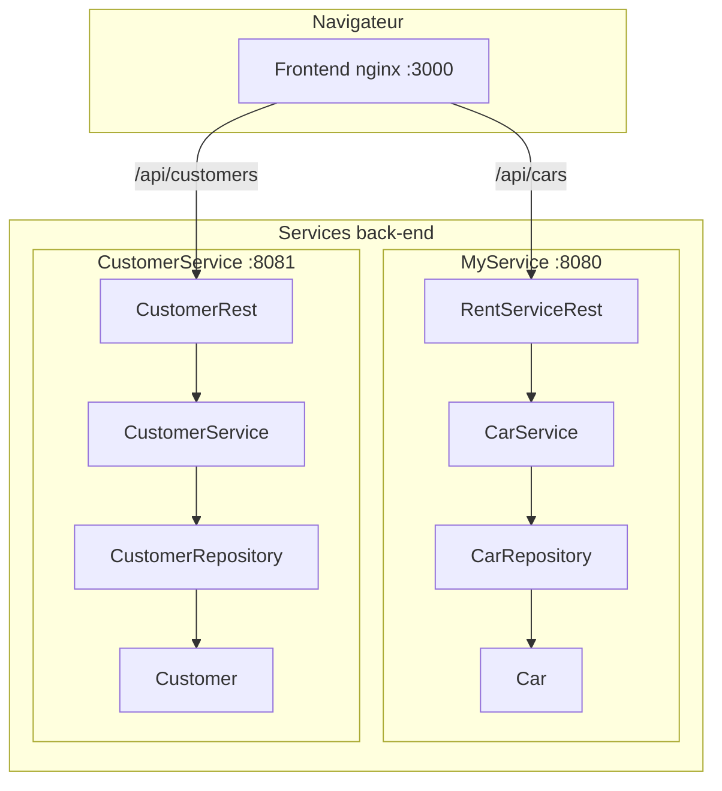

# Rent — Application de location de voitures

Projet DevOps

| | |
|---|---|
| **Étudiants** | Patrick WU · Louisa MAIBECHE |
| **Groupe** | LSI2 |
| **Dépôt GitHub** | https://github.com/GeratorWu/rent-main |

---

## Description

**Rent** est une application de gestion de location de voitures composée de :

- **MyService** — API REST de gestion de la flotte automobile (voitures)
- **CustomerService** — API REST de gestion des clients
- **Frontend** — interface web pour interagir avec les deux services

Le projet respecte les pratiques DevOps : dépôt Git, pipeline CI, architecture en couches, tests automatisés, couverture de code et analyse qualité.

> Rapport complet pour la remise Moodle : voir **[RAPPORT.md](RAPPORT.md)**  
> Guide de test détaillé : voir **[TESTING.md](TESTING.md)**

---

## Architecture



Chaque service back-end suit l'architecture en **3 couches** :

| Couche | Rôle | Exemple |
|--------|------|---------|
| **Controller** | Expose l'API REST (web) | `RentServiceRest`, `CustomerRest` |
| **Service** | Logique métier | `CarService`, `CustomerService` |
| **Data** | Accès aux données | `CarRepository`, `CustomerRepository` |

---

## Structure du projet

```
rent-main/
├── MyService/              # Service voitures (Spring Boot, port 8080)
├── CustomerService/        # Service clients (Spring Boot, port 8081)
├── frontend/               # Interface web (HTML/CSS/JS + nginx, port 3000)
├── docker-compose.yml      # Orchestration des 3 services
├── .github/workflows/      # Pipeline CI (GitHub Actions)
├── scripts/                # Scripts de test d'intégration
├── RAPPORT.md              # Rapport écrit pour Moodle
└── TESTING.md              # Guide de test
```

---

## Prérequis

- [Java 21](https://adoptium.net/) (JDK)
- [Docker Desktop](https://www.docker.com/products/docker-desktop/)
- Git

---

## Démarrage rapide (Docker — recommandé)

```powershell
# Cloner le dépôt
git clone [URL du dépôt]
cd rent-main

# Lancer les 3 services
docker compose up --build -d

# Vérifier que tout tourne
docker compose ps
```

| Service | URL |
|---------|-----|
| **Frontend** | http://localhost:3000 |
| **MyService API** | http://localhost:8080 |
| **CustomerService API** | http://localhost:8081 |

Arrêter les services :

```powershell
docker compose down
```

---

## Tests

### Tests unitaires et couverture (local)

```powershell
cd MyService
.\gradlew.bat clean test jacocoTestReport

cd ..\CustomerService
.\gradlew.bat clean test jacocoTestReport
```

Rapports générés :
- Tests : `build/reports/tests/test/index.html`
- Couverture JaCoCo : `build/reports/jacoco/test/html/index.html`

### Test d'intégration automatique

```powershell
.\scripts\test-integration.ps1
```

### Pipeline CI

À chaque push ou pull request sur `main` / `develop`, GitHub Actions exécute automatiquement :

1. Tests unitaires des deux services back-end
2. Rapports JaCoCo (artefacts téléchargeables)
3. Analyse SonarCloud (si configuré)
4. Build Docker des 3 images
5. Tests d'intégration via Docker Compose

Résultats : onglet **Actions** du dépôt GitHub → [Lien vers la dernière exécution CI]

---

## API REST

### MyService (voitures) — port 8080

| Méthode | Endpoint | Description |
|---------|----------|-------------|
| `GET` | `/` | Health check |
| `POST` | `/cars` | Ajouter une voiture |
| `GET` | `/cars` | Lister toutes les voitures |
| `GET` | `/cars/{plateNumber}` | Récupérer une voiture |

Exemple :

```powershell
Invoke-RestMethod -Method Post -Uri http://localhost:8080/cars `
  -ContentType "application/json" `
  -Body '{"plateNumber":"ABC123","brand":"Toyota","price":15000.0}'
```

### CustomerService (clients) — port 8081

| Méthode | Endpoint | Description |
|---------|----------|-------------|
| `GET` | `/` | Health check |
| `POST` | `/customers` | Ajouter un client |
| `GET` | `/customers` | Lister tous les clients |
| `GET` | `/customers/{id}` | Récupérer un client |

---

## Conformité au sujet DevOps

| Exigence | Statut |
|----------|--------|
| Dépôt Git | ✅ |
| Pipeline CI | ✅ |
| Architecture en couches (Data / Service / Controller) | ✅ |
| Au moins 2 services back + Docker | ✅ |
| Tests unitaires + MockMvc | ✅ |
| Couverture de code (JaCoCo) | ✅ |
| Qualité logicielle (SonarCloud) | ✅ [À confirmer — voir RAPPORT.md] |
| Front Web (bonus) | ✅ |
| Base de données (bonus) | ❌ [Optionnel — non implémenté] |
| Continuous Delivery | Non requis |

---

## Collaboration Git (Pull Request)

```powershell
git checkout -b ma-branche
# ... modifications ...
git add .
git commit -m "Description des changements"
git push -u origin ma-branche
```

Créer une Pull Request sur GitHub → la CI se déclenche automatiquement.

Après merge :

```powershell
git checkout main
git pull origin main
```

---

## Licence

[Choix de licence — ex. Projet académique, usage pédagogique uniquement]
