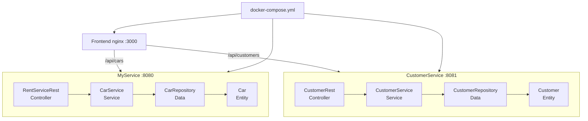

# Guide de test — Projet DevOps Rent

Ce document décrit comment vérifier que les deux services back fonctionnent correctement, en local et via Docker.

## Architecture



| Service | Rôle | Port |
|---------|------|------|
| **MyService** | Gestion des voitures | 8080 |
| **CustomerService** | Gestion des clients | 8081 |
| **Frontend** | Interface web (nginx) | 3000 |

---

## 1. Tests unitaires et couverture (local)

### Prérequis
- Java 21
- Gradle (via `./gradlew` inclus dans chaque service)

### MyService

```powershell
cd MyService
.\gradlew.bat clean test jacocoTestReport
```

Rapport HTML : `MyService/build/reports/tests/test/index.html`  
Couverture JaCoCo : `MyService/build/reports/jacoco/test/html/index.html`

### CustomerService

```powershell
cd CustomerService
.\gradlew.bat clean test jacocoTestReport
```

Rapport HTML : `CustomerService/build/reports/tests/test/index.html`  
Couverture JaCoCo : `CustomerService/build/reports/jacoco/test/html/index.html`

### Ce qui est testé

| Couche | MyService | CustomerService |
|--------|-----------|-----------------|
| **Data** | `CarRepositoryTest` | `CustomerRepositoryTest` |
| **Service** | `CarServiceTest` | `CustomerServiceTest` |
| **Controller** | `RentServiceRestTest` (MockMvc) | `CustomerRestTest` (MockMvc) |
| **Entité** | `CarTest` | `CustomerTest` |

---

## 2. Lancer un service en local (sans Docker)

Terminal 1 — MyService :

```powershell
cd MyService
.\gradlew.bat bootRun
```

Terminal 2 — CustomerService :

```powershell
cd CustomerService
.\gradlew.bat bootRun
```

---

## 3. Tests manuels de l'API (PowerShell)

Une fois les services démarrés :

### MyService (port 8080)

```powershell
# Health check
Invoke-RestMethod http://localhost:8080/

# Ajouter une voiture
Invoke-RestMethod -Method Post -Uri http://localhost:8080/cars `
  -ContentType "application/json" `
  -Body '{"plateNumber":"ABC123","brand":"Toyota","price":15000.0}'

# Lister les voitures
Invoke-RestMethod http://localhost:8080/cars

# Récupérer une voiture
Invoke-RestMethod http://localhost:8080/cars/ABC123
```

### CustomerService (port 8081)

```powershell
# Health check
Invoke-RestMethod http://localhost:8081/

# Ajouter un client
Invoke-RestMethod -Method Post -Uri http://localhost:8081/customers `
  -ContentType "application/json" `
  -Body '{"id":"C001","name":"Alice","email":"alice@example.com"}'

# Lister les clients
Invoke-RestMethod http://localhost:8081/customers

# Récupérer un client
Invoke-RestMethod http://localhost:8081/customers/C001
```

---

## 4. Front Web

Le frontend est une application HTML/CSS/JS servie par **nginx**. Il communique avec les APIs via un proxy interne (`/api/cars` → MyService, `/api/customers` → CustomerService), ce qui évite les problèmes CORS.

### Lancer avec Docker (recommandé)

```powershell
docker compose up --build -d
```

Ouvrir dans le navigateur : **http://localhost:3000**

Fonctionnalités :
- Onglet **Voitures** : ajouter et lister les voitures
- Onglet **Clients** : ajouter et lister les clients

### Structure du frontend

```
frontend/
├── index.html
├── css/style.css
├── js/app.js
├── nginx.conf      # proxy vers les services back
└── Dockerfile
```

---

## 5. Tests avec Docker Compose

Depuis la racine du projet :

```powershell
# Construire et démarrer les 3 services (back + front)
docker compose up --build -d

# Vérifier que les conteneurs tournent
docker compose ps

# Ouvrir le front : http://localhost:3000
# Tester les endpoints API (voir section 3)

# Arrêter et supprimer les conteneurs
docker compose down
```

### Script de test automatique

```powershell
.\scripts\test-integration.ps1
```

Ce script :
1. Lance `docker compose up --build -d`
2. Attend que les services soient prêts
3. Teste les endpoints des deux services
4. Affiche ✅ ou ❌ pour chaque test
5. Arrête les conteneurs à la fin

---

## 6. Pipeline CI (GitHub Actions)

À chaque push ou pull request sur `main` / `develop`, la CI :

1. Exécute tous les tests des deux services
2. Génère les rapports JaCoCo (artefacts téléchargeables)
3. Lance SonarCloud (si les secrets sont configurés)
4. Construit les trois images Docker (2 back + front)
5. Lance `docker compose up` et teste les APIs + le frontend avec `curl`

Vérifier les résultats : onglet **Actions** du dépôt GitHub.

---

## 7. Checklist avant remise Moodle

- [ ] `./gradlew test` passe pour **MyService** et **CustomerService**
- [ ] Rapports JaCoCo générés et captures d'écran prises
- [ ] SonarCloud configuré et rapport exporté
- [ ] `docker compose up --build` démarre les 3 services sans erreur
- [ ] Front web accessible sur http://localhost:3000
- [ ] Tests manuels API OK sur les ports 8080 et 8081
- [ ] CI verte sur GitHub Actions
- [ ] Rapport écrit avec schéma d'architecture et captures Google labs
